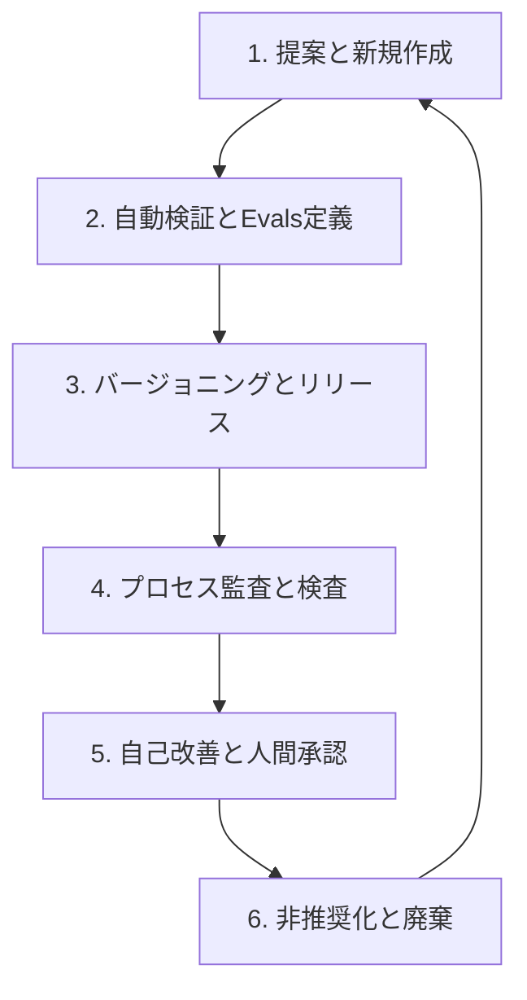

# 組織カスタムスキルのライフサイクル管理プロセス提案書
(Skills Lifecycle Management Process Proposal)

本提案書は、AIコーディングエージェント向けカスタムスキル（`.claude/skills/*`）の品質維持、形式の健全性、効果検証、および自動リリースの全工程におけるガバナンスと再現性を担保するための「ライフサイクル管理プロセス」を定義するものです。

---

## 1. 背景と目的
AIエージェント向けのスキルファイルは、時間の経過に伴う開発ルールの変化や、新たなアンチパターンの出現によって肥大化、あるいは陳腐化するリスクを伴います。本プロセスを導入することで、スキル定義のライフサイクル（提案・作成から廃棄まで）を厳格に管理し、エージェントが常に最新かつ安全で検証可能な開発基準に従って稼働できる状態を保証します。

---

## 2. スキルライフサイクルの各フェーズ

スキルのライフサイクルは、以下の6つのフェーズから構成され、それぞれ定義された手続きに則って実行されます。

### 2.1 提案と新規作成 (Proposal & Creation)
- **手続き**: 
  - 新規スキルを作成、または既存スキルの適用範囲を大きく変更する際は、事前にADR (Architecture Decision Record) を `docs/adr/` に作成し、設計背景と役割を記録する。
  - スキルのマークダウンファイルは、`.claude/skills/<スキル名>/SKILL.md` に配置する。
  - **フロントマター制約**: YAMLフロントマターには `name`、`description`、`user-invocable`、`license`、`compatibility`、`allowed-tools`、および `metadata.version` を漏れなく記述しなければならない。

### 2.2 自動検証と品質アサーション (Continuous Evaluation / Evals)
- **手続き**:
  - 各スキルは、その効果を客観的に測定するために「エージェントが陥りやすい罠 (Trap)」と「検証アサーション (Assertions)」を定義した `evals/evals.json` などの評価ファイルを配置する。
  - 変更を加える際は、`make check` などのシンタックスチェッカーを実行し、形式エラーをCIパイプラインで自動検知できる状態を維持する。

### 2.3 バージョニングと自動リリース (Versioning & Automated Release)
- **手続き**:
  - スキル定義やEvalsの修正がPRとしてマージされた際、`tagpr`（または同等のリリース自動化ツール）を使用して、自動的にバージョンバンプ、CHANGELOGの生成、およびGitタグ（`vX.Y.Z`）の付与を実行する。
  - タグ付けを検知したCI/CDワークフロー（`GoReleaser` 等）により、最新のスキル定義一式を自動パッケージングし、組織内の共有レジストリ（`~/.claude/skills/` 等）へ自動配布する。

### 2.4 変更管理とプロセス監査 (Change Management & Quality Inspection)
- **手続き**:
  - スキルが適用される対象リポジトリ側では、変更が適用される都度、5者のペルソナ（Goアーキテクト、SRE、DBA、QA、SIRT）による監査レビューを実行し、結果を `docs/audit_report.md` に記録する。
  - 品質検査官（Quality Inspector）が、設計・実装・テスト・CI/CD・評価の全フェーズにわたる「プロセス全体の監査網羅性マトリクス」と、テストの正常/異常/セキュリティ等の「テスト網羅性マトリクス」を含んだ `docs/inspection_report.md` を都度生成し、プロセスの適合を証明する。

### 2.5 自己改善ループと人間承認 (Self-Evaluation & Sign-off)
- **手続き**:
  - プロジェクト側の要件適合率を `make self-eval` コマンドで集計し、[REQUIREMENTS.md](file:///Users/shjtmy/gravity/go_sh0jitmy_template/REQUIREMENTS.md) に適合率 100% のログを同期する。
  - 不適合（FAIL）項目が存在する場合、エージェントは自律的自己改善ループによりリファクタリングを繰り返す。
  - 最終的に、すべての監査・検査レポートを人間に提示し、**人間の直接確認と明示的な署名（Sign-off）を必須の完了条件**とする。
  - **スキル自体の自己改善手順 (AIエージェント向け実行ワークフロー)**:
    1. **不適合の検知**: `make check` でのエラー、Evals自動検証での不適合、またはユーザーによるスキル定義バグの指摘をトリガーとして自己改善フェーズに入る。
    2. **原因分析**: スキル内のどのルール（またはアサーション）が現実のコードと乖離しているか、あるいはバグの原因になっているかを特定する。
    3. **スキル修正とバージョン管理**: 対象スキルの `SKILL.md` を修正し、`metadata.version` をパッチ（またはマイナー）バンプする。
    4. **ローカル確認の実行**: `make check` による文法チェックおよび `make self-eval` による要件適合率の更新を行い、エラーがないことを検証する。
    5. **人間への承認申請**: スキルそのものの書き換え・自己改善に対して、**変更理由、修正差分（diff）、および検証結果を人間に提示し、明示的な変更承認（Sign-off）を得る。承認が得られるまでは、グローバルディレクトリや本番用レジストリへの反映（`make install`）を行ってはならない。**

### 2.6 非推奨化と廃棄 (Deprecation & Disposal)
- **手続き**:
  - 古くなった、あるいは上位互換のスキルに統合されて不要になったスキルは、フロントマターに `status: deprecated` および代替スキルへのリンクを明記する。
  - 一定の移行期間を経た後、組織の Skills Registry またはレジストリ設定（`skills.json` 等）から対象スキルを完全に削除し、安全に廃棄する。

---

## 3. ガバナンス維持のまとめ
本提案書に基づくライフサイクルプロセスを適用することで、開発標準としてのカスタムスキル自体の品質が継続的に担保され、AIエージェントの開発支援におけるガバナンスと、検証・再現の容易性を常に高いレベルで維持することが可能となります。
